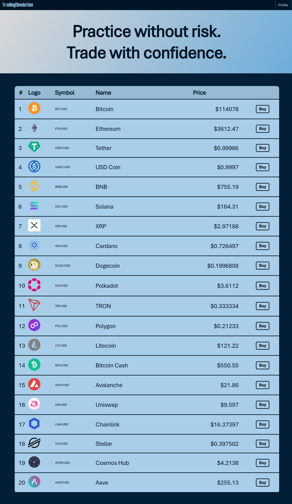
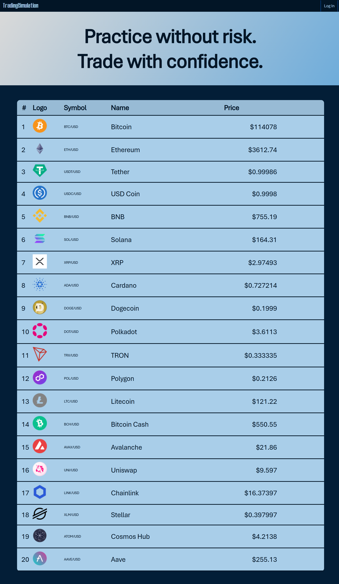
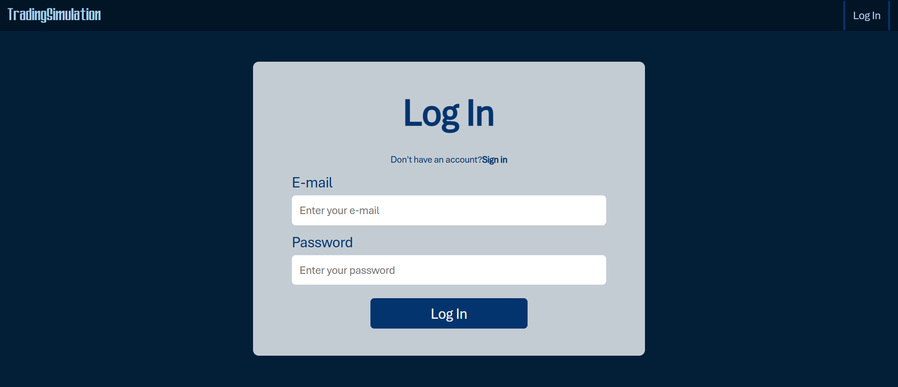
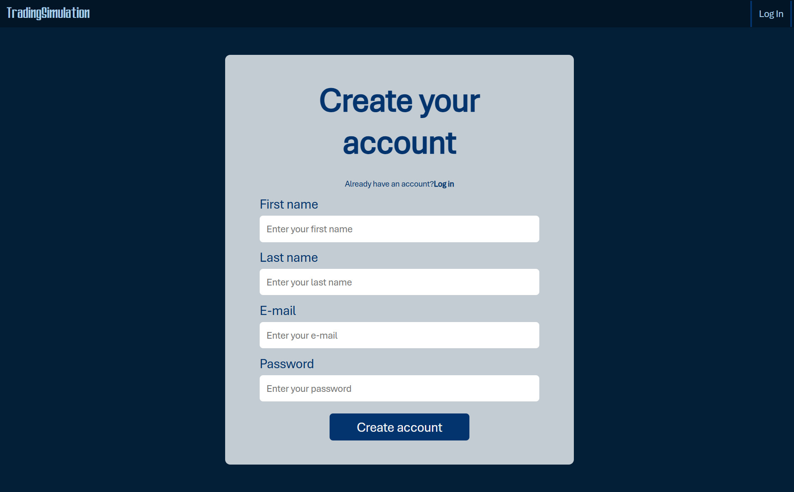
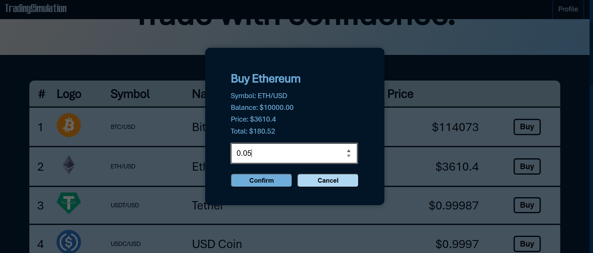
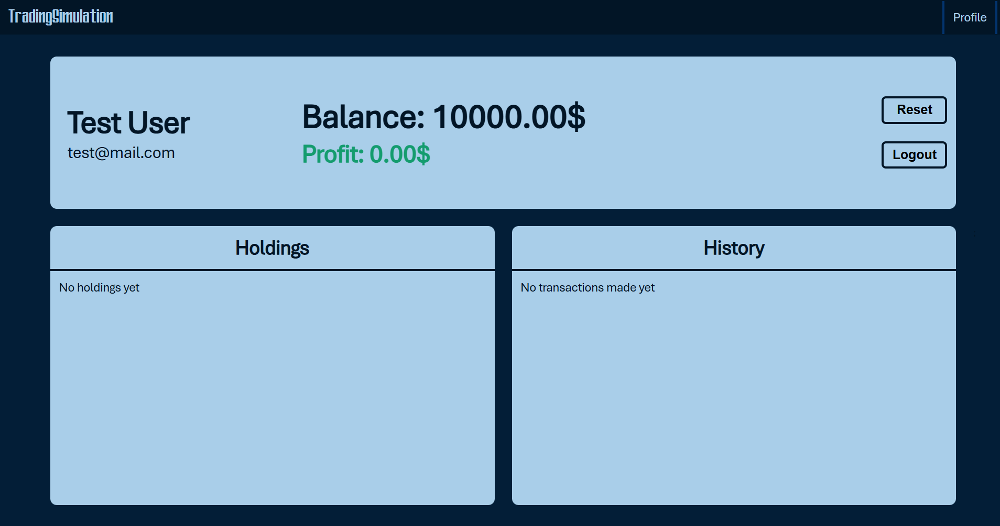
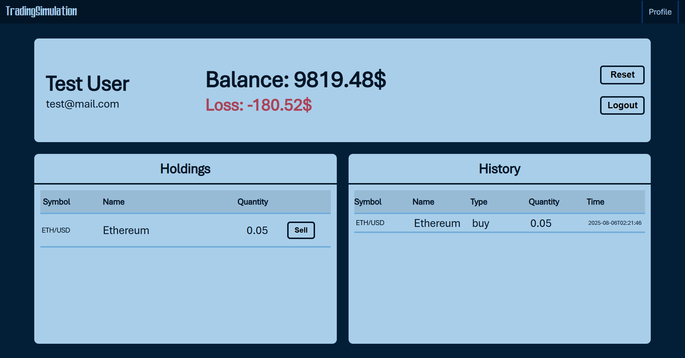
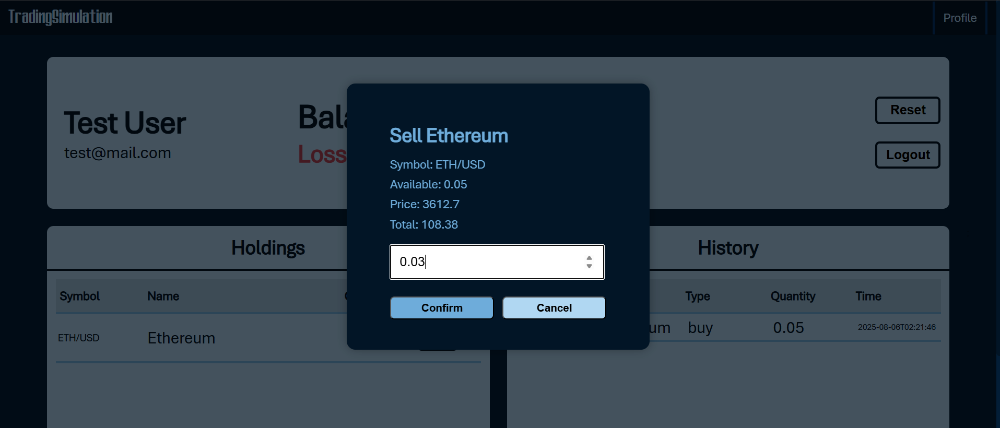
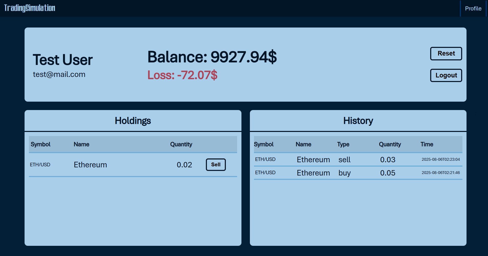

# Crypto Trading Simulation

A web application simulating a cryptocurrency trading platform with real-time price updates via Kraken V2 WebSocket API.

---

## Features

- Real-time prices for the top 20 cryptocurrencies via Kraken V2 WebSocket API
- Virtual account balance (starts with $10 000)
- Buy and sell cryptocurrencies
- Track your transaction history, profit and loss
- Reset your account balance and holdings

---

## Technologies

- Frontend: React, JavaScript, HTML, CSS
- Backend: Java, Spring Boot
- Database: MySQL
- API: Kraken V2 WebSocket API 

---

## How to Run the Project

1. Make sure you have **Maven**, **npm** and **MySQL** installed.
2. Create the database (name: `trading`), and run the SQL script, located in: backend/src/main/resources/sql/create_tables.sql
3. Run the backend:
cd backend
mvn spring-boot:run
4. Run the frontend:
cd frontend
npm start
The frontend will start at http://localhost:3000

---

## Screenshots

- Home Page displaying top 20 cryptocurrency prices(depending on whether the user is logged in) 
 

- Login and Register pages
 

- Form for buying cryptocurrencies

- User interface (new or reset account, after buying, form for selling, after selling)

  
 

- Screen recording demonstrating a user journey through the main functionalities of the platform
[Youtube Video](https://youtu.be/_lagfGM-dyM)

